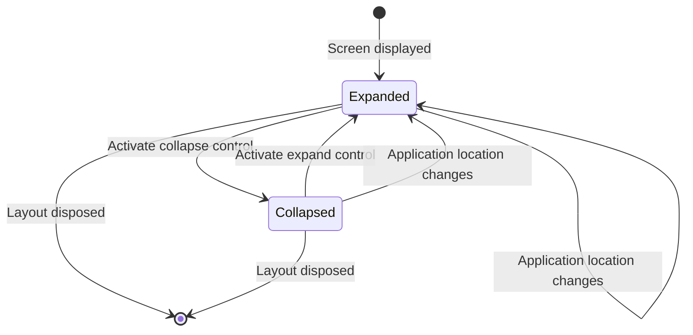

# Data Model: Action Panel Expand/Collapse

## Scope

This feature introduces no persisted entity, database schema, migration, or service contract. It uses one transient presentation model owned by the shared layout.

## Entity: ActionPanelState

Represents the current presentation state of the action panel for the active application screen.

| Field | Type | Required | Description |
|---|---|---:|---|
| `IsExpanded` | Boolean | Yes | `true` when the original panel and links are visible; `false` when only the expansion control remains. |
| `CurrentLocation` | URI/string observation | Yes | The navigation location used to detect a screen transition; it is observed, not persisted as feature data. |

## Derived Presentation Values

| Value | Expanded state | Collapsed state |
|---|---|---|
| Panel width | Existing width (250px on desktop) | Compact control rail width |
| Action links | Visible according to existing authorization rules | Hidden and unavailable to keyboard navigation |
| Control action name | Collapse action panel | Expand action panel |
| `aria-expanded` | `true` | `false` |
| Main content width | Existing available width | Remaining width released by the panel |

## Validation Rules

- `IsExpanded` MUST default to `true` when a layout is first displayed.
- A user activation MUST invert `IsExpanded` exactly once.
- Any change to the current application location MUST set `IsExpanded` to `true`.
- Direct page entry and refresh MUST create the state as expanded.
- State changes MUST NOT alter route data, user identity, authorization, page model state, or link definitions.
- The state MUST NOT be written to a database, browser storage, cookie, query string, or user profile.

## State Transitions

## Relationships

- `ActionPanelState` is owned by the active `MainLayout` instance.
- It controls the presentation of the existing `NavMenu` but does not own or modify navigation links.
- It changes the width available to the routed page body but does not own or modify page data.
