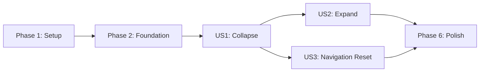

# Tasks: Action Panel Expand/Collapse

> **Superseded:** Do not execute these tasks. Use [003-action-panel-expand-collapse/tasks.md](../003-action-panel-expand-collapse/tasks.md).

**Input**: Design documents from `/specs/002-action-panel-expand-collapse/`
**Prerequisites**: plan.md, spec.md, research.md, data-model.md, contracts/action-panel-ui.md, quickstart.md

**Tests**: Automated component tests are included because the project constitution requires test-first, verifiable behavior for user-facing changes.

**Organization**: Tasks are grouped by user story so each behavior can be implemented and validated as an incremental slice.

## Format: `[ID] [P?] [Story] Description`

- **[P]**: Can run in parallel because it changes a different file and does not depend on an incomplete task
- **[Story]**: Maps the task to its user story in spec.md
- Every task includes an exact file path

## Phase 1: Setup (Shared Infrastructure)

**Purpose**: Add the component-test dependency required by the approved test strategy.

- [ ] T001 Add a .NET 9-compatible bUnit package reference to `ContosoDashboard.Tests/ContosoDashboard.Tests.csproj`

---

## Phase 2: Foundational (Blocking Prerequisites)

**Purpose**: Establish the reusable rendered-layout test context required by every user story.

**CRITICAL**: No user story test can begin until this fixture is available.

- [ ] T002 Create a bUnit layout test fixture with configurable authenticated roles, a routable test body, and access to the test `NavigationManager` in `ContosoDashboard.Tests/Shared/MainLayoutTestContext.cs`

**Checkpoint**: The test project can render `MainLayout` under authenticated user and Administrator scenarios.

---

## Phase 3: User Story 1 - Collapse the Action Panel (Priority: P1)

**Goal**: Let a user collapse the expanded blue panel so only the control remains and the main content gains the released width without losing page state.

**Independent Test**: Render the layout, activate the collapse control once, and verify the links are absent, the control remains, the collapsed layout class is applied, and the same routed body instance and header remain present.

### Tests for User Story 1

> Write these tests first and confirm they fail before implementation.

- [ ] T003 [US1] Add failing component tests for the default expanded state, one-activation collapse, hidden non-focusable links, retained toggle, unchanged header, and retained body state in `ContosoDashboard.Tests/Shared/MainLayoutTests.cs`

### Implementation for User Story 1

- [ ] T004 [P] [US1] Add layout-local `IsExpanded` state, the semantic collapse button, conditional `NavMenu` presentation, `aria-expanded`, and the `action-panel-collapsed` state class in `ContosoDashboard/Shared/MainLayout.razor`
- [ ] T005 [P] [US1] Add stable expanded and compact collapsed sidebar widths, flexible main-content growth, overflow protection, a transition under 500 milliseconds, visible button focus, responsive rules, and `prefers-reduced-motion` handling in `ContosoDashboard/wwwroot/css/site.css`
- [ ] T006 [US1] Run the collapse-focused tests from `ContosoDashboard.Tests/Shared/MainLayoutTests.cs` and verify the US1 scenarios pass without changing routed body state

**Checkpoint**: User Story 1 is independently demonstrable: one activation collapses the panel and expands the main area.

---

## Phase 4: User Story 2 - Expand the Action Panel (Priority: P1)

**Goal**: Let a user restore the collapsed panel to its original size with every authorized link and the original content layout intact.

**Independent Test**: Start from the collapsed state, activate the remaining control, and verify the original 250px desktop panel state, authorized links, active route indication, action name, and main-content layout return.

### Tests for User Story 2

> Write these tests first and confirm they fail before completing the inverse transition.

- [ ] T007 [US2] Add failing component tests for second-activation expansion, restored link order, state-specific accessible name, `aria-expanded="true"`, active `NavLink` preservation, and Administrator-only Document Reports visibility in `ContosoDashboard.Tests/Shared/MainLayoutTests.cs`

### Implementation for User Story 2

- [ ] T008 [US2] Complete the inverse toggle path so the collapsed control restores `IsExpanded`, the original `NavMenu`, state-specific Bootstrap Icon and accessible action name, and expanded layout classes in `ContosoDashboard/Shared/MainLayout.razor`
- [ ] T009 [US2] Run the expand-focused tests from `ContosoDashboard.Tests/Shared/MainLayoutTests.cs` and verify all existing link routes and role visibility remain unchanged after collapse and expansion

**Checkpoint**: User Stories 1 and 2 form a complete reversible panel interaction and the recommended MVP.

---

## Phase 5: User Story 3 - Reset Panel on Navigation (Priority: P2)

**Goal**: Ensure every destination, direct opening, and refresh begins with the action panel expanded.

**Independent Test**: Collapse the rendered panel, navigate through the test `NavigationManager`, and verify the destination layout is expanded while route outcomes and authorization-sensitive links remain unchanged.

### Tests for User Story 3

> Write these tests first and confirm they fail before adding location handling.

- [ ] T010 [US3] Add failing component tests for reset on location changes, expanded initial render, browser-style direct entry behavior, preserved link destinations, and disposal of navigation event handling in `ContosoDashboard.Tests/Shared/MainLayoutTests.cs`

### Implementation for User Story 3

- [ ] T011 [US3] Inject `NavigationManager`, subscribe to `LocationChanged`, reset `IsExpanded` on every location change, marshal rerendering correctly, and unsubscribe through layout disposal in `ContosoDashboard/Shared/MainLayout.razor`
- [ ] T012 [US3] Run the navigation-reset tests from `ContosoDashboard.Tests/Shared/MainLayoutTests.cs` and verify panel-link, non-panel, programmatic, and direct-entry scenarios start expanded

**Checkpoint**: All three user stories work together and navigation never carries a collapsed state onto another screen.

---

## Phase 6: Polish & Cross-Cutting Concerns

**Purpose**: Validate the completed feature across supported viewports and the complete solution.

- [ ] T013 [P] Execute all pointer, keyboard, authorization, reduced-motion, and responsive scenarios at 1440x900, 1024x768, and 390x844 from `specs/002-action-panel-expand-collapse/quickstart.md`
- [ ] T014 [P] Build `ContosoDashboard.sln` and run the full suite in `ContosoDashboard.Tests/ContosoDashboard.Tests.csproj`, resolving only regressions introduced by this feature

---

## Dependencies & Execution Order

### Phase Dependencies

- **Setup (Phase 1)**: Starts immediately.
- **Foundational (Phase 2)**: Depends on T001 and blocks all story tests.
- **User Story 1 (Phase 3)**: Depends on Phase 2 and establishes the shared panel state and collapsed layout.
- **User Story 2 (Phase 4)**: Depends on User Story 1 because it begins from the collapsed state.
- **User Story 3 (Phase 5)**: Depends on User Story 1 for collapsible state, but does not depend on User Story 2 and may proceed in parallel with it after US1.
- **Polish (Phase 6)**: Depends on all stories included in the delivery.

### User Story Dependency Graph



### Within Each User Story

- Write the story's tests and confirm the relevant assertions fail before implementation.
- Implement the smallest behavior that satisfies the story contract.
- Run the story-focused tests before starting dependent work.
- Preserve the existing `NavLink` definitions and `AuthorizeView` boundary rather than duplicating navigation behavior.

### Parallel Opportunities

- After T003 fails as expected, T004 and T005 can proceed in parallel because they change Razor and CSS independently against the named `action-panel-collapsed` contract.
- After US1 completes, US2 and US3 can be assigned in parallel, with coordination required because T008 and T011 both edit `ContosoDashboard/Shared/MainLayout.razor`.
- T013 and T014 can run in parallel after all selected stories are complete.

---

## Parallel Example: User Story 1

```text
Task T004: Implement layout state and accessible panel control in ContosoDashboard/Shared/MainLayout.razor
Task T005: Implement expanded/collapsed responsive styling in ContosoDashboard/wwwroot/css/site.css
```

## Parallel Example: User Stories 2 and 3

```text
Developer A: Complete T007-T009 for reversible expansion and link restoration
Developer B: Complete T010-T012 for navigation reset and event disposal
Coordination point: Serialize T008 and T011 edits to ContosoDashboard/Shared/MainLayout.razor
```

---

## Implementation Strategy

### Coherent MVP: User Stories 1 and 2

1. Complete T001-T002 for component-test infrastructure.
2. Complete T003-T006 and validate collapse independently.
3. Complete T007-T009 and validate reversible expansion.
4. Stop and demonstrate the complete collapse/expand interaction.

US1 alone proves space reclamation, but US1 plus US2 is the smallest user-safe delivery because users must be able to restore navigation after collapsing it.

### Incremental Delivery

1. Setup and foundation establish repeatable layout testing.
2. US1 delivers collapse and main-content expansion.
3. US2 delivers restoration and completes the P1 MVP.
4. US3 adds predictable expanded state across navigation.
5. Polish validates accessibility, responsive layout, timing, and full regression coverage.

### Parallel Team Strategy

1. Complete T001-T003 sequentially.
2. Run T004 and T005 in parallel, then complete T006.
3. Assign US2 and US3 to separate developers after US1, serializing their shared layout edits.
4. Run T013 and T014 in parallel after integration.

---

## Notes

- `[P]` means the task changes a different file and has no dependency on another incomplete task in the same phase.
- `[US1]`, `[US2]`, and `[US3]` provide traceability to the feature specification.
- No database, service, API, browser-storage, cookie, or user-profile tasks are required.
- Existing navigation routes, authorization, and active-state behavior are regression constraints, not redesign targets.
- Do not modify unrelated application behavior or tests while resolving feature-specific failures.
