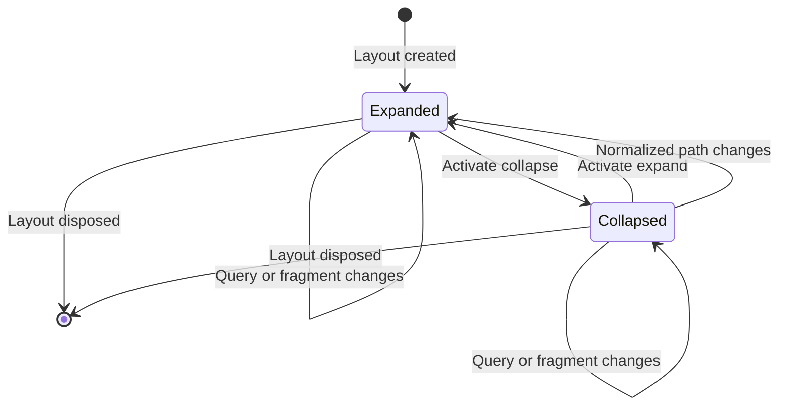

# Data Model: Action Panel Expand/Collapse

## Scope

This feature introduces no persisted entity, database schema, migration, or service contract. It uses one transient presentation model owned by the active shared layout.

## Entity: ActionPanelState

| Field | Type | Required | Description |
|---|---|---:|---|
| `IsExpanded` | Boolean | Yes | Whether the full panel is currently displayed. Defaults to `true`. |
| `CurrentRoutePath` | Normalized path | Yes | Current application route path without query or fragment, used only to detect screen changes. |

## Derived Presentation Values

| Value | Expanded | Collapsed |
|---|---|---|
| Panel width | Existing 250px desktop width | Minimum stable control rail width |
| Brand-row height | Existing 3.5rem | Existing 3.5rem |
| Brand content | Visible | Hidden |
| Authorized navigation links | Visible | Hidden and not keyboard-focusable |
| Control action | Collapse action panel | Expand action panel |
| `aria-expanded` | `true` | `false` |
| Main content | Existing width | Fills released horizontal area |

## Route Path Normalization

- Convert the observed location to an application-relative path.
- Remove query-string and fragment components before comparison.
- Treat the empty path as the root path.
- Normalize trailing slashes so equivalent forms of the same route do not trigger a reset.
- Preserve panel state when the normalized path is unchanged.
- Set `IsExpanded` to `true` and update `CurrentRoutePath` when the normalized path changes.

## Validation Rules

- A new layout state MUST begin expanded.
- One control activation MUST invert `IsExpanded` once.
- Hidden brand and navigation content MUST not be keyboard-focusable.
- A route-path change MUST reset state to expanded.
- A query-only or fragment-only change MUST retain state.
- Toggling MUST NOT change routed body state, identity, authorization, route definitions, or link active state.
- State MUST NOT survive a full page load, another routed screen, or another user session.

## State Transitions

## Relationships

- `MainLayout` owns `ActionPanelState` and route observation.
- `NavMenu` consumes expanded/collapsed presentation state without changing link definitions or authorization.
- The routed body receives more or less available width but does not consume or mutate panel state.
