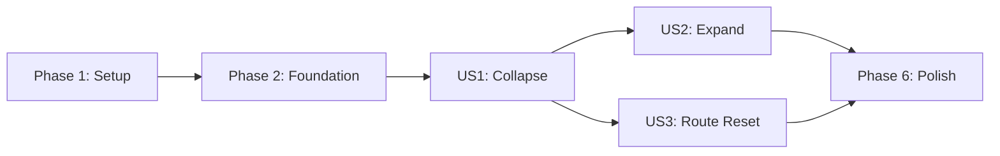

# Tasks: Action Panel Expand/Collapse

**Input**: Design documents from `/specs/003-action-panel-expand-collapse/`
**Prerequisites**: plan.md, spec.md, research.md, data-model.md, contracts/action-panel-ui.md, quickstart.md

**Tests**: Test tasks are included because the constitution requires test-first verification for user-facing behavior and the implementation plan explicitly selects bUnit component tests.

**Organization**: Tasks are grouped by user story so collapse, expansion, and route-reset behavior can be implemented and validated as incremental slices.

## Format: `[ID] [P?] [Story] Description`

- **[P]**: Can run in parallel because it changes a different file and does not depend on unfinished work
- **[Story]**: Maps the task to a user story in spec.md
- Every task includes an exact file path

## Phase 1: Setup (Shared Infrastructure)

**Purpose**: Add the rendered-component test dependency selected by the implementation plan.

- [X] T001 Add a .NET 9-compatible bUnit package reference in `ContosoDashboard.Tests/ContosoDashboard.Tests.csproj`

---

## Phase 2: Foundational (Blocking Prerequisites)

**Purpose**: Establish the reusable layout test environment required by all three stories.

**CRITICAL**: No story tests can begin until this fixture can render the authenticated layout and control navigation.

- [X] T002 Create a bUnit fixture with configurable authenticated roles, a stateful routed test body, and access to the test NavigationManager in `ContosoDashboard.Tests/Shared/MainLayoutTestContext.cs`

**Checkpoint**: `MainLayout` can be rendered for Administrator and non-Administrator users with observable routed-body state and navigation.

---

## Phase 3: User Story 1 - Collapse the Action Panel (Priority: P1)

**Goal**: Allow one pointer or keyboard activation to collapse the panel, hide brand and navigation content from view and focus, and release width to the unchanged main content.

**Independent Test**: Render an expanded layout with stateful body content, activate collapse once, and verify only the panel control remains, the collapsed class is applied, both header heights remain represented, and body state is unchanged.

### Tests for User Story 1

> Write these tests first and confirm the relevant assertions fail before implementation.

- [X] T003 [US1] Add failing component tests for initial expanded state, pointer/Enter/Space collapse, state-specific accessible name and ARIA values, hidden non-focusable brand/navigation content, retained headers, and retained routed-body state in `ContosoDashboard.Tests/Shared/MainLayoutTests.cs`

### Implementation for User Story 1

- [X] T004 [P] [US1] Add expanded-state parameters, a stable navigation-region identifier, and conditional brand/link rendering without changing existing NavLink order or Administrator AuthorizeView boundaries in `ContosoDashboard/Shared/NavMenu.razor`
- [X] T005 [P] [US1] Add the 250px expanded width, compact control-rail width, flexible main growth, stable 3.5rem header rows, overflow protection, visible focus, sub-500ms transition, responsive rules, and reduced-motion override in `ContosoDashboard/wwwroot/css/site.css`
- [X] T006 [US1] Add layout-local expanded state, the semantic top-right collapse button with directional Bootstrap Icon and ARIA contract, collapsed layout classes, and NavMenu state binding in `ContosoDashboard/Shared/MainLayout.razor` after T004 and T005
- [X] T007 [US1] Run the collapse-focused tests in `ContosoDashboard.Tests/Shared/MainLayoutTests.cs` and verify all User Story 1 assertions pass

**Checkpoint**: User Story 1 independently reclaims main-content width without changing page state or exposing hidden focus targets.

---

## Phase 4: User Story 2 - Expand the Action Panel (Priority: P1)

**Goal**: Restore the original panel, brand content, authorized links, active destination, and main-content geometry from the collapsed state.

**Independent Test**: Start collapsed, activate the remaining control once, and verify the 250px desktop state, authorized links in original order, active indication, brand row, and main-content width return.

### Tests for User Story 2

> Write these tests first and confirm the inverse-transition assertions fail before implementation.

- [X] T008 [US2] Add failing component tests for one-activation expansion, restored brand and link order, `aria-expanded="true"`, collapse action name, active NavLink preservation, and Administrator-only Document Reports visibility in `ContosoDashboard.Tests/Shared/MainLayoutTests.cs`

### Implementation for User Story 2

- [X] T009 [US2] Complete the inverse toggle path and state-specific icon/action name so expansion restores NavMenu content, authorized links, and expanded layout classes in `ContosoDashboard/Shared/MainLayout.razor`
- [X] T010 [US2] Run the expansion-focused tests in `ContosoDashboard.Tests/Shared/MainLayoutTests.cs` and verify link destinations, ordering, active state, and role visibility remain unchanged after collapse and expansion

**Checkpoint**: User Stories 1 and 2 provide the complete reversible P1 interaction and form the coherent MVP.

---

## Phase 5: User Story 3 - Reset Panel on Screen Navigation (Priority: P2)

**Goal**: Reset the panel only when the normalized application route path changes, while retaining state for query-string and fragment-only changes.

**Independent Test**: Collapse the panel, navigate to another normalized path and verify expansion; repeat with query-only, fragment-only, root-equivalent, and trailing-slash-equivalent locations and verify state is retained.

### Tests for User Story 3

> Write these tests first and confirm route-reset assertions fail before implementation.

- [X] T011 [US3] Add failing component tests for initial expanded state, different-path reset, query-only retention, fragment-only retention, root/trailing-slash equivalence, direct-entry behavior, preserved destinations, and navigation-event disposal in `ContosoDashboard.Tests/Shared/MainLayoutTests.cs`

### Implementation for User Story 3

- [X] T012 [US3] Inject NavigationManager, normalize application-relative paths without query or fragment, reset only for changed normalized paths, rerender safely, and unsubscribe on disposal in `ContosoDashboard/Shared/MainLayout.razor`
- [X] T013 [US3] Run the navigation-focused tests in `ContosoDashboard.Tests/Shared/MainLayoutTests.cs` and verify all eight documented destinations reset correctly while same-path query and fragment changes retain state

**Checkpoint**: All user stories are functional and screen navigation has predictable, bounded reset behavior.

---

## Phase 6: Polish & Cross-Cutting Concerns

**Purpose**: Validate visual layout, application workflows, authorization, usability, and complete regression safety.

- [X] T014 [P] Execute the pointer, keyboard, authorization, responsive, timing, mobile-menu, and reduced-motion scenarios at 390x844, 1024x768, and 1440x900 in `specs/003-action-panel-expand-collapse/quickstart.md`
- [X] T015 [P] Execute five collapse/expand cycles while preserving Profile form entry, Documents filtering, and My Tasks interaction as specified in `specs/003-action-panel-expand-collapse/quickstart.md`
- [ ] T016 Conduct the moderated first-use check with at least 10 representative users, record completion outcomes, and confirm at least 90% success in `specs/003-action-panel-expand-collapse/checklists/first-use-validation.md`
- [X] T017 Build `ContosoDashboard.sln`, run the full suite in `ContosoDashboard.Tests/ContosoDashboard.Tests.csproj`, and resolve only regressions introduced by this feature

---

## Dependencies & Execution Order

### Phase Dependencies

- **Setup (Phase 1)**: Starts immediately.
- **Foundational (Phase 2)**: Depends on T001 and blocks all user-story tests.
- **User Story 1 (Phase 3)**: Depends on Phase 2 and establishes shared panel state and collapsed presentation.
- **User Story 2 (Phase 4)**: Depends on User Story 1 because expansion starts from the collapsed state.
- **User Story 3 (Phase 5)**: Depends on User Story 1 for collapsible state but does not depend on User Story 2; it may begin after US1 when shared-file edits are coordinated.
- **Polish (Phase 6)**: Depends on all stories selected for delivery; T016 can begin only after the complete interaction is demonstrable.

### User Story Dependency Graph



### Within Each User Story

- Write the story tests and confirm the relevant assertions fail before implementation.
- Preserve existing NavLink and AuthorizeView definitions rather than duplicating navigation or security behavior.
- Implement the smallest behavior that satisfies the story contract.
- Run story-focused tests before starting dependent work.

### Parallel Opportunities

- After T003 fails as expected, T004 and T005 can run in parallel because they change NavMenu and CSS independently; T006 then integrates their contracts.
- After US1, US2 and US3 may be assigned in parallel, but T009 and T012 must be serialized because both edit `ContosoDashboard/Shared/MainLayout.razor`.
- T014 and T015 can run in parallel after all stories are integrated.
- T016 is independent of T017 once the feature is deployed to the moderated training environment.

---

## Parallel Example: User Story 1

```text
Task T004: Add collapse-aware brand and navigation rendering in ContosoDashboard/Shared/NavMenu.razor
Task T005: Add responsive expanded/collapsed layout styling in ContosoDashboard/wwwroot/css/site.css
Integration after both: Task T006 in ContosoDashboard/Shared/MainLayout.razor
```

## Parallel Example: User Stories 2 and 3

```text
Developer A: Complete T008-T010 for reversible expansion
Developer B: Complete T011-T013 for normalized route-path reset
Coordination point: Serialize T009 and T012 edits to ContosoDashboard/Shared/MainLayout.razor
```

---

## Implementation Strategy

### Coherent MVP: User Stories 1 and 2

1. Complete T001-T002 for test infrastructure.
2. Complete T003-T007 and validate collapse independently.
3. Complete T008-T010 and validate restoration independently.
4. Stop and demonstrate the complete reversible panel interaction.

US1 independently demonstrates space reclamation, but US1 plus US2 is the smallest user-safe release because navigation must be restorable after collapse.

### Incremental Delivery

1. Setup and foundation establish rendered-layout testing.
2. US1 delivers collapse and main-content expansion.
3. US2 completes the reversible P1 MVP.
4. US3 adds path-sensitive navigation reset without disrupting filters or fragments.
5. Polish validates the three viewports, named workflows, role behavior, moderated usability, and full regression suite.

### Parallel Team Strategy

1. Complete T001-T003 sequentially.
2. Run T004 and T005 in parallel, then integrate through T006 and validate with T007.
3. Assign US2 and US3 separately while serializing their MainLayout edits.
4. Run T014 and T015 in parallel, then complete T016-T017.

---

## Notes

- `[P]` tasks change different files and have no dependency on unfinished work in the same phase.
- `[US1]`, `[US2]`, and `[US3]` provide traceability to the specification.
- No database, API, service, persistence, cookie, or user-profile tasks are required.
- Existing routes, role visibility, active-state behavior, mobile navigation, and both header rows are regression constraints.
- Do not modify unrelated application behavior or tests while resolving feature-specific failures.
